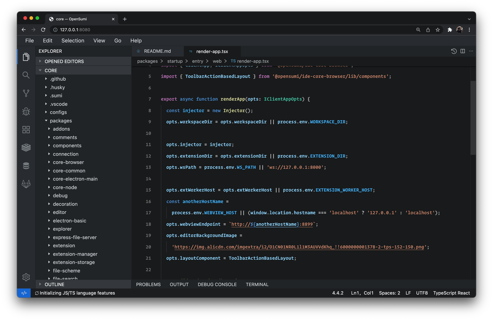
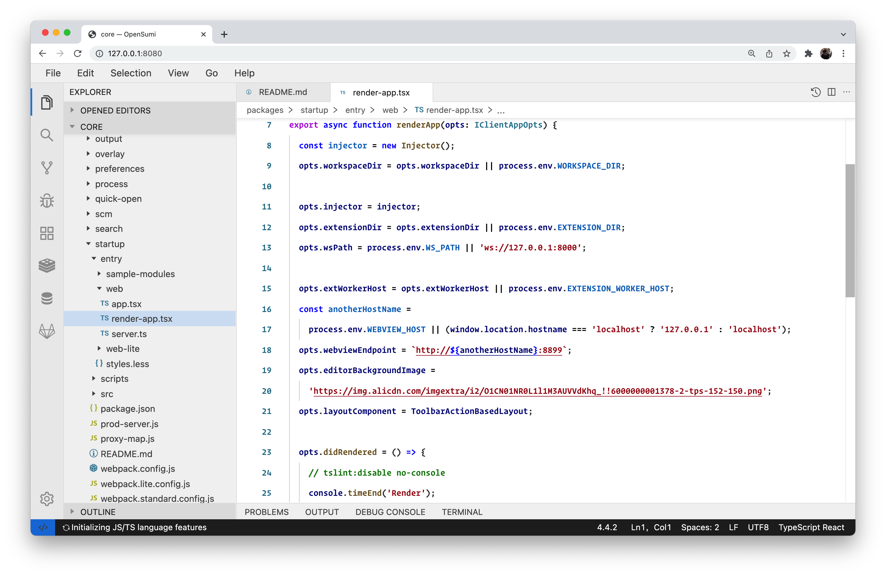
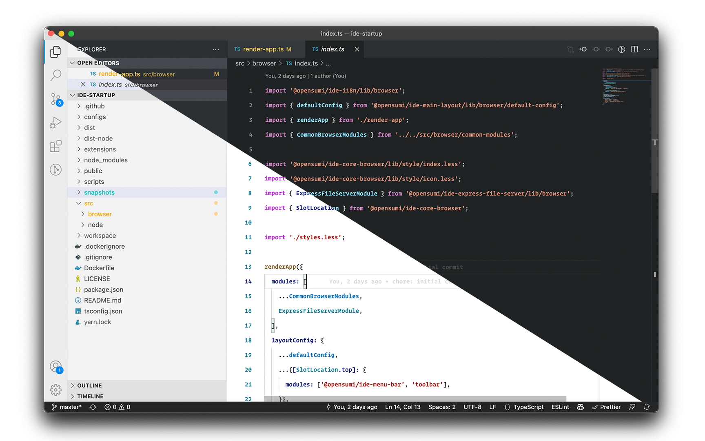

  

<h1 align="center">OpenSumi Default Themes</h1>

### OpenSumi Dark Theme

### OpenSumi Light Theme

### VS Code

[Install from VS Marketplace](https://marketplace.visualstudio.com/items?itemName=opensumi.opensumi-default-themes)

